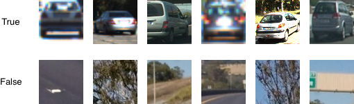
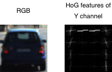

## Vehicle Detection using HoG and Support Vector Classifier

This project consists of designing an image classifier that identifies the (cropped) presence of a vehicle and then repurposes the classifier to detect vehicles in an image or video of broader context and with an arbitrary number of vehicles. The classifier can be decomposed into a feature extractor using a histogram of oriented gradients (HoG) and a support vector classifier. Click on the image below for a video of the detection system in use during highway driving. A write-up is also available at [www.lrgonzales.com/vehicle-detection-using-hog-and-svc](http://www.lrgonzales.com/vehicle-detection-using-hog-and-svc).

### Introduction
Vehicle detection — and, more generally, object detection — is a complex and safety-critical problem faced by self-driving vehicles, particularly given the various geometries and colors of vehicles present in the real-world. Adding to the challenge of detection, vehicles can be occluded by other objects, including other vehicles. Moreover, it’s critical that a detection system be robust to varied weather and lighting conditions.

### Detection Framework
This project achieves vehicle detection by first implementing an object (vehicle) classifier and uses it to analyze subsections of an image on which detection is to be performed. An example of the technique is shown in Fig. 1. The area within the dotted white rectangle would be fed to the image classifier, which would be expected to deem that the region does not contain a vehicle. The rectangle is stepped throughout the image in a technique referred to as sliding windows and is done so at pre-determined step sizes and aspect ratios. If the area within the rectangle is not the size of the native image classifier, resizing is necessary.

  

  
Fig. 1: Image on which detection is to be performed with  depiction of region to be analyzed by the image classifier.

Although the sliding windows technique presents challenges of its own in practice, particularly in terms of filtering out false positives, the remainder of this documentation focuses on the image classifier.

### Image Classifier
The image classifier leverages traditional computer vision techniques, namely feature extraction followed by classification. In particular, the HoG feature extractor and Linear Support Vector Classifier (SVC) were used. A random sampling of the dataset is shown below in the same resolution as used by the classifier, 64 x 64 pixels. The dataset contains 8,792 true labels ([vehicles](https://s3.amazonaws.com/udacity-sdc/Vehicle_Tracking/vehicles.zip)) and 8,972 false labels ([not vehicles](https://s3.amazonaws.com/udacity-sdc/Vehicle_Tracking/non-vehicles.zip)).

  

  
Fig. 2: Random sampling of dataset.

While it’s beyond the intended scope of this documentation to describe HoG in detail (refer to [1]), note that the HoG technique steps through portions of an image and computes the orientation (or angle) of the gradient at each step. In this project, rather than calculating the gradients in the RGB colorspace, the YUV colorspace was used for robustness. Having performed the colorspace mapping, HoG features are extracted for each channel independently. The result of each channel is shaped into a one-dimensional vector and concatenated with the HoG features of other channels, resulting in a final feature vector in ℝ1188 R1188. Fig. 3 gives a visualization of the HoG features for the Y channel (note: images enlarged from native 64 x 64 to show detail).

  

  
Fig. 3: Enlarged RGB image and  HoG features of Y channel.

Training consists of obtaining HoG feature vectors for the entire training set and fitting a linear SVC to the feature vectors and the corresponding training labels (True/False). Using an SVC penalty parameter of C=1.0, a training set accuracy of 1.0 and validation set accuracy of 0.988 was achieved. The SVC penalty parameter and the HoG parameters were treated as hyperparameters during the training process.

### Improvements
The HoG feature extractor along with SVC appears to work very well as a standalone classifier in this application; however, using it in a larger image for detection by way of the sliding windows technique proved to be challenging, requiring a lot of fine-tuning. Reducing the step size of the sliding windows implementation may help, but this would come at the penalty of increased computation. It’d be worthwhile to investigate recent detection techniques, particularly the You Only Look Once (YOLO) algorithm.

### Usage
Run `./init.sh` to obtain the dataset in `./data/`.

#### Training
Run `python ./src/steer_net_train.py` to train the model. The trained Keras model saves to `./`. The chosen values for the hyperparameters (learning rate and batch size) are predefined in `./src/steer_net_train.py`, but these can be changed by redefining `alpha` and `batch_sz`.

#### Self-Driving
To configure the car in autonomous mode, run `python src/drive.py steer_net_model.h5`, open the simulator app, choose a desired track, and click `AUTONOMOUS MODE`. The speed set during autonomous mode is defined in `src/drive.py` as `set_speed`.

### Dependencies
The project makes use of `gdrive` and the following Python packages: `numpy`, `matplotlib`, `opencv`, `pandas`, `sklearn`, `scipy`.

### References
[1] [Histograms of Oriented Gradients for Human Detection, N. Dalal et al., 2005](https://lear.inrialpes.fr/people/triggs/pubs/Dalal-cvpr05.pdf)
