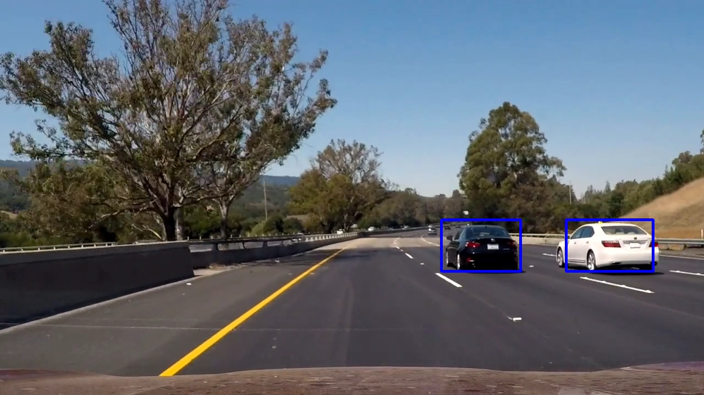
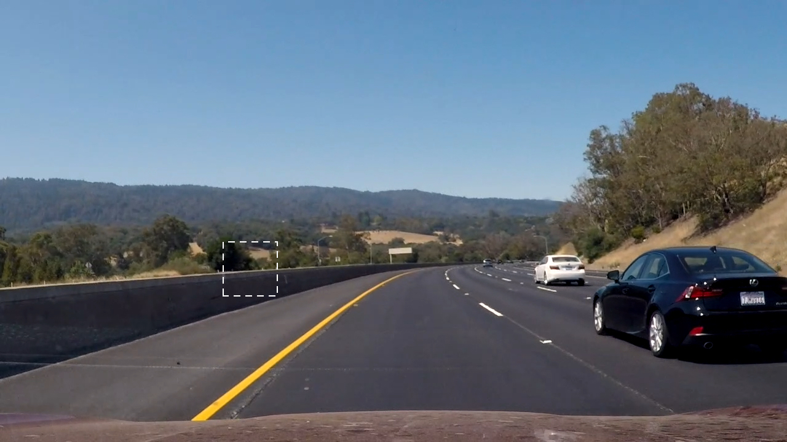

## Vehicle Detection using HoG and Support Vector Classifier

This project consists of designing an image classifier that identifies the (cropped) presence of a vehicle and then repurposes the classifier to detect vehicles in an image or video of broader context and with an arbitrary number of vehicles. The classifier can be decomposed into a feature extractor using a histogram of oriented gradients (HoG) and a support vector classifier. Click on the image below for a video of the detection system in use during highway driving. A write-up is also available at [www.lrgonzales.com/vehicle-detection-using-hog-and-svc](http://www.lrgonzales.com/vehicle-detection-using-hog-and-svc).

### Introduction
Vehicle detection — and, more generally, object detection — is a complex and safety-critical problem faced by self-driving vehicles, particularly given the various geometries and colors of vehicles present in the real-world. Adding to the challenge of detection, vehicles can be occluded by other objects, including other vehicles. Moreover, it’s critical that a detection system be robust to varied weather and lighting conditions.

### Detection Framework
This project achieves vehicle detection by first implementing an object (vehicle) classifier and uses it to analyze subsections of an image on which detection is to be performed. An example of the technique is shown in Fig. 1. The area within the dotted white rectangle would be fed to the image classifier, which would be expected to deem that the region does not contain a vehicle. The rectangle is stepped throughout the image in a technique referred to as sliding windows and is done so at pre-determined step sizes and aspect ratios. If the area within the rectangle is not the size of the native image classifier, resizing is necessary.

  

  
Fig. 1: Image on which detection is to be performed with depiction of region to be analyzed by the image classifier.

Although the sliding windows technique presents challenges of its own in practice, particularly in terms of filtering out false positives, the remainder of this documentation focuses on the image classifier.

### Image Classifier
With the simulator in training mode, each track was driven twice in the default direction of traffic. To prevent overfitting and to generally have more data to train and validate on, each track was driven twice in the opposite direction as well. Given that the majority of time is spent driving straight (0°) and in flat terrain, additional data was captured in sections with sharp turns and/or steep gradients. To ensure that the network had the most reliable data to learn (and validate) from, an analog joystick was used when driving around the tracks, as opposed to keyboard controls, which often lead to a jerky response.

Fig. 3(a) shows a histogram of the steering angle data collected in training mode. The high count of steering angles equal to 0° is a result of the two tracks containing long stretches of straight roadway. If this data were fed directly into the CNN during training, it's likely that the trained model would have a bias towards 0°. To alleviate this issue, data samples with a steering angle label equal to 0° were downsampled by approximately one-fifth. A histogram of the resulting dataset is shown in Fig. 3(b).

  

  
Fig. 3: Histogram of the data collected   in training mode before (a) and   after (b) downsampling.

Using only the center camera for prediction (architecture discussed later) might suggest that only center camera images be used for training. However, it is possible to use the left and right camera images to represent what's referred to as recovery data. Similar to a human learning to recover after veering from the center of a lane, recovery data trains the CNN what to do in the event it finds itself off-center. For example, if Fig. 5(d) (cropping discussed later), an image from the left camera, were actually captured by the center camera, the corresponding steering angle should represent a corrective angle to the right. Similarly, Fig. 5(f) would require the opposite corrective action. To implement this, images from the left and right camera should have their corresponding labels include a correction factor. This approach was described in a 2016 paper by NVIDIA [1] and effectively triples the training data while implicitly including recovery data. If recovery data were not available implicitly through the left and right cameras, it would have to be collected explicitly.

Fig. 4 shows a histogram of the data from Fig. 3(b) after it has undergone the augmentation of recovery data as described above. This resulting dataset is subsequently split to create a training set and a validation set.

  

  
Fig. 4: Histogram of the final dataset   with recovery data.

### CNN Architecture and Training
In addition to the common normalization scheme for images ([0, 255] ↦ [0, 1.0]), cropping and resizing were also implemented as part of preprocessing. Specifically, the top 55 pixels and bottom 25 pixels were cropped and the resulting image was resized to 200 x 66 [1]. Cropping allows for the CNN to focus on the most relevant content without having to learn superfluous information (sky, scenery, etc). Perhaps more importantly, cropping and resizing result in smaller activation layers and thus fewer CNN parameters, leading to quicker processing in real-time applications. Fig. 5 shows the cropping and resizing that would be performed on the example capture from Fig. 2.

  

  
Fig. 5: Cropping and resizing performed on set of images in Fig. 2.

The CNN architecture is borrowed from NVIDIA [1], has a total of 252,219 trainable parameters, and takes in a single image as input (center camera). A complete diagram of the architecture, depicting the activation layers, is shown below with the preprocessing layers omitted for brevity. The architecture from comma.ai [2] was considered but resulted in nearly seven times as many trainable parameters.

  

  
Fig. 6: CNN architecture borrowed from NVIDIA.

The learning rate and batch size were treated as hyperparameters during the training process. The model was trained using RMS loss and the Adam optimizer.

  

  
Fig. 7: Training and validation loss.

### Performance
Given the nature of the task at hand, a test set metric was not captured. Instead, driving performance was visually inspected in autonomous mode. The model successfully completes both tracks at a speed of 20 MPH.

### Future Work
Because the solution is expected to perform in real-time within a self-driving car, further efforts could be made in terms of exploring CNN architectures, particularly residual networks, with fewer parameters, easing processing requirements. It would also be interesting to see if performing a perspective transform within the cropped region leads to improvements. Lastly, there may be benefits in using two (left and right) or all three camera inputs into the CNN architecture; however, recovery data would have to be explicitly collected.

### Usage
Run `./init.sh` to obtain the dataset in `./data/` and the saved Keras model in `./`.

#### Training
Run `python ./src/steer_net_train.py` to train the model. The trained Keras model saves to `./`. The chosen values for the hyperparameters (learning rate and batch size) are predefined in `./src/steer_net_train.py`, but these can be changed by redefining `alpha` and `batch_sz`.

#### Self-Driving
To configure the car in autonomous mode, run `python src/drive.py steer_net_model.h5`, open the simulator app, choose a desired track, and click `AUTONOMOUS MODE`. The speed set during autonomous mode is defined in `src/drive.py` as `set_speed`.

### Dependencies
The project makes use of `numpy`, `matplotlib`, `tensorflow`, `keras`, `cv2`, `sklearn`, and `gdrive`.

### References
[1] [End to End Learning for Self-Driving Cars, NVIDIA, 2016](https://images.nvidia.com/content/tegra/automotive/images/2016/solutions/pdf/end-to-end-dl-using-px.pdf) 
[2] [Learning a Driving Simulator, comma.ai, 2016](https://arxiv.org/pdf/1608.01230.pdf)
